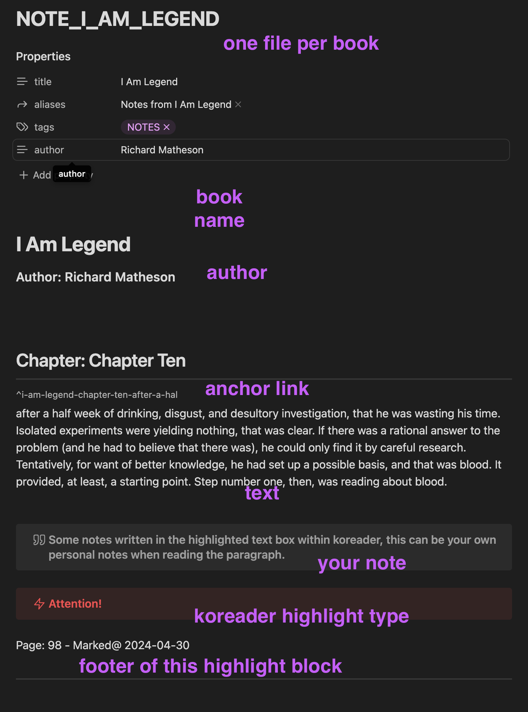

# obsidian_koreader

```bash
bun install
```

To run:

```bash
bun run index.ts
```
Converts Koreader into Markdown with Obsidian Callouts & ^links

- /in - this folder is the json input from koreader, can by synced using folderSync
- /out - this is the folder for MD output based on the 'latest' file of 'in' folder. it will ignore all other files

- The /in folder will automatically cleaned out after creating md
- The out folder will be replaced by the latest eg: NOTE_NAME_OF_BOOK.md
- Internal pages are marked with ^book_chpater_page_highlitedText as ref links


## TODO
- cron server
- cron job
- automatic sync
- bun test have issues, cant be ran


```
// Example input in the /in folder
{
    "version": "json/1.0.0",
    "documents": [
        {
            "author": "Claire Keegan",
            "entries": [
                {
                    "sort": "highlight",
                    "drawer": "invert",
                    "text": "the",
                    "page": 10,
                    "chapter": "1",
                    "time": 1714486566,
                    "note": "1346yfeufuƒťûgdjgfifʈ"
                },
                {
                    "sort": "highlight",
                    "drawer": "underscore",
                    "text": "while in the distance. I wish I was out there, working. I am unused to sitting still and do not know what to do with my hands. Part of me wants my father to leave me here while",
                    "page": 10,
                    ....
                },
                {
                    "sort": "highlight",
                    "drawer": "strikeout",
                    ....
                }
            ],
            "title": "Foster",
            "file": "/storage/emulated/0/Books/PushBooks/Foster (Claire Keegan).epub"
        },
        {
            "author": "Richard Matheson",
            ...
```

Result per block under a book

